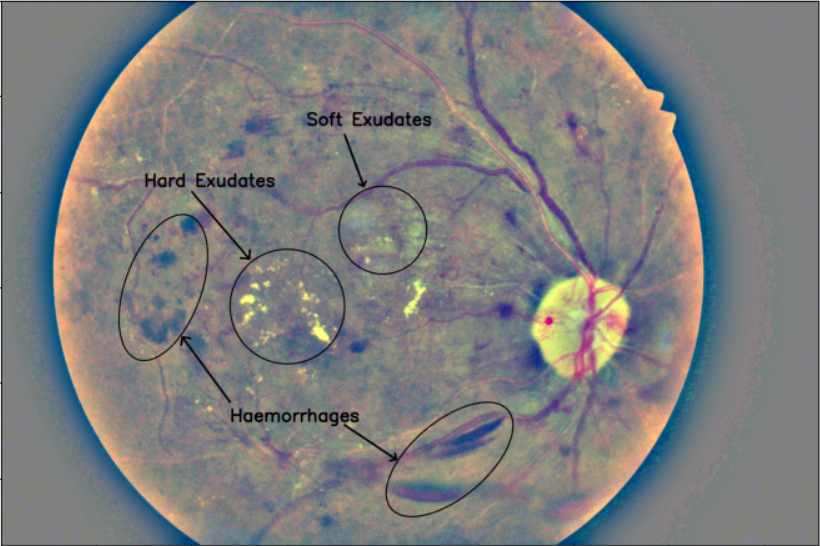
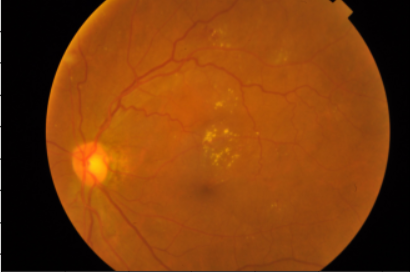
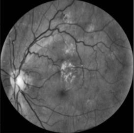
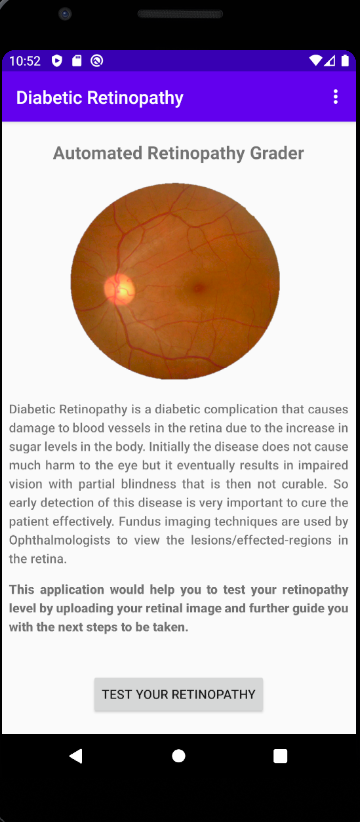
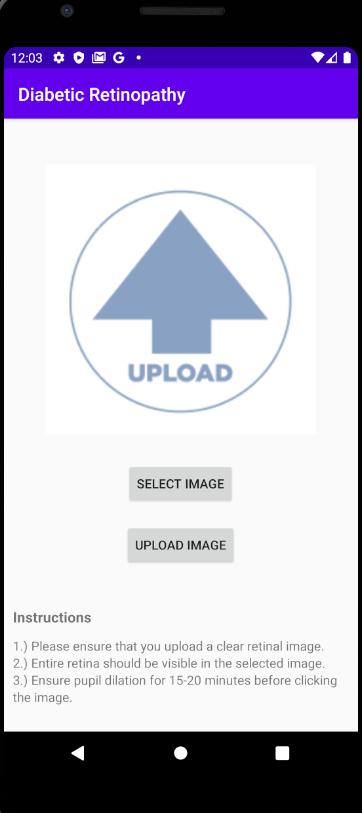
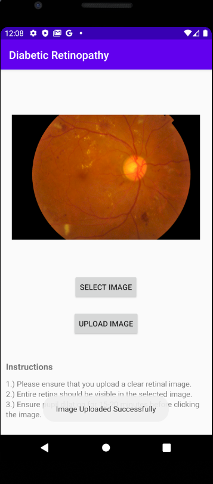

# Diabetic_Retinopathy
## Diabetic Retinopathy is a diabetic complication that effects the retina. Diabetic Retinopathy is generally regarded as increase in the blood sugar levels in the retinal area that can cause problems like Visual Impairment including partial blindness and also a blur and unclear vision at its severe stage.
### Diabetic Retinopathy is a problem in individuals usually ageing from 20-70. It can be cured completely only if it is recognized early. So early detection systems and automated classifiers are very useful in this disease that help to recognise it efficiently and fast.
### Diabetic Retinopathy is classified/recognized based on certain lesions and some other factors as well. There are 4 to 5 common lesions that are possible:
- Microaneurysms
- Haemorrhages
- Hard Exudates
- Soft Exudates
- Drusens
#### 
#### These lesions are explained in the notebook 'Detecting the problems.ipynb'

## There are a lot of datasets available that consists of Fundus Retinal Images that can be used to aid this disease. Several AI researchers and scientists have made excellent state of the art models for aiding the early detection of retinopathy. 
### My Research Work on Datasets and in depth information regarding the disease and its analysis are listed in 'Research Work' Directory of the Repo.
Some of the popular open source datasets are:
- DiaretDB0 and DiaretDB1
- Messidor-1 and Messidor-2
- Aptos-2015 and Aptos-2019
- DRIVE
- STARE
- Inspire
- Drions-DB
- E-Ophtha
- HRF

# Data Cleaning and Pre-Processing
#### These datasets are made by experts of the disease (Ophthalmologists) using varities of fundus camera systems. The datasets available on kaggle or anywhere would be just raw images directy shot from the fundus camera maybe after pupil dilation. So to make an efficient model we need to crop the images to supress the background noise and also pre-process them using imaging filters before using them for training. I have used 'CLAHE' (Contrast Limited Adaptive Histogram Equalisation) to filter the images before training.
Here the 1st image is the raw image from Aptos-2019 and the 2nd image is the cropped and preprocessed version.
####  &nbsp;&nbsp;&nbsp;&nbsp;&nbsp;&nbsp;&nbsp;&nbsp;&nbsp;&nbsp;&nbsp;&nbsp;&nbsp;&nbsp;

#### These tasks are performed in 'Image_cropping_and_clahe.ipynb' in the 'Preprocessing' Directory.

# Models
#### I have used some pretrained models from tensorflow with 'imagenet' weights and tried to train a multiclass-classification model to predict the Retinopathy Grading. 2 models were trained one using Xception Net and the second using Efficient Net and python notebooks for both of them are available in 'Models' Directory in the Repo. The weights of these models are uploaded into 'Model Weights' Directory.

# Android Application
#### I am currently making an application with a view to help people with early detection of Retinopathy. The application is currently under development and will use TensorflowLite to deploy my CNN model onto the application for the classification of retinopathy. The android app is uploaded in the 'DR_android_application' Director of the Repo. Some of the sample shots of the current application are listed below.
#### 
#### 
#### 

#### There are many more models to be tried out to get the best classification model that could be deployed in the application. If there are any suggestions please feel free to submit a pull request, I would be happy to include contributors for this Repo. Thank you, Happy Coding😀😀!!!
